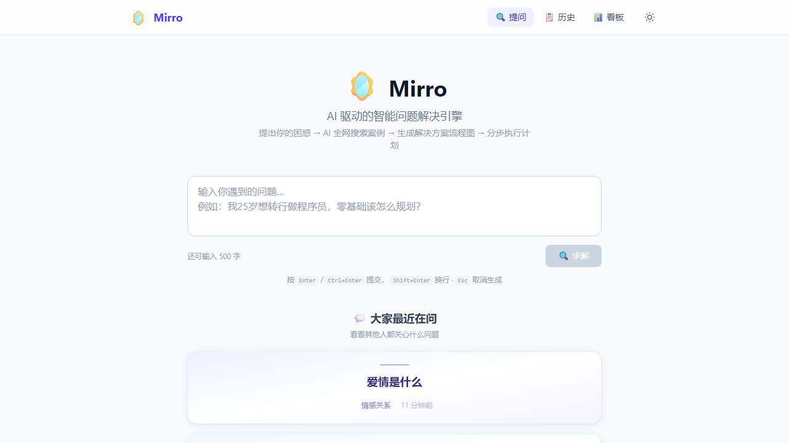
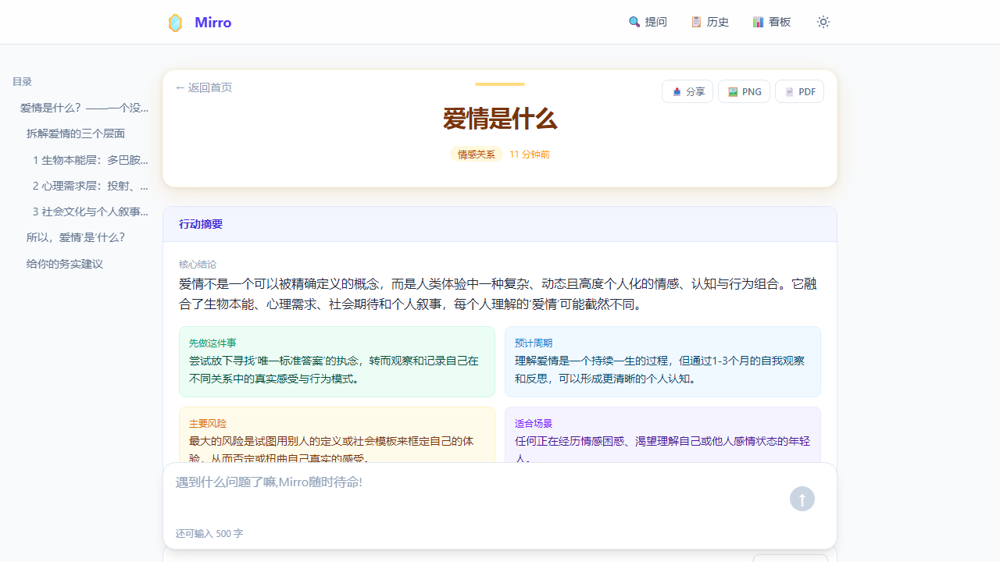

# 🪞 Mirro — AI 智能问题解决引擎

面向年轻人的 AI 驱动问题解决平台。**提问 → 全网搜索案例 → AI 分析解答 → 生成解决方案流程图 → 分步执行计划**。

## 📸 项目预览

**🏠 首页 — 提问入口**



> 输入问题，可选澄清向导补充现状、目标和限制条件

**📋 答案页 — AI 结构化解答**



> Markdown 流式输出 + Mermaid 流程图 + 分步执行计划 + 代码块一键复制

## 🛠 技术栈

| 层 | 技术 | 说明 |
|---|------|------|
| 前端 | Vue 3 + TypeScript + Vite | Composition API + `<script setup>` |
| 样式 | Tailwind CSS v4 | 原子化 CSS |
| 路由 | Vue Router 4 | SPA 路由管理 |
| 状态 | Pinia | 流式答案生成状态管理 |
| 图表 | Mermaid.js + ECharts | 流程图渲染 + 统计图表 |
| 后端 | Python FastAPI | 异步 Web 框架 |
| AI | OpenAI / Claude API | LLM 答案生成 |
| 搜索 | Tavily Search API | 全网案例检索 |
| 数据库 | SQLite + aiosqlite | 零配置本地数据库 |

## 📁 项目结构

```
Mirro/
├── frontend/              # Vue 3 前端
│   └── src/
│       ├── api/           # API 客户端（SSE流式请求）
│       ├── components/    # 可复用组件
│       ├── views/         # 页面视图
│       ├── stores/        # Pinia 状态管理
│       ├── router/        # Vue Router 路由配置
│       └── types/         # TypeScript 类型定义
├── backend/               # Python FastAPI 后端
│   └── app/
│       ├── api/           # API 路由
│       ├── services/      # AI/搜索/流程图 服务层
│       ├── models/        # 数据库 + Pydantic 模型
│       └── core/          # 配置管理
└── README.md
```

## 🚀 快速启动

### 1. 配置环境变量

```bash
cd backend
cp .env.example .env
# 编辑 .env 填入真实的 API Key:
#   LLM_API_KEY=sk-xxx    (OpenAI / Claude / DeepSeek)
#   TAVILY_API_KEY=tvly-xxx (Tavily 搜索 API)
```

### 2. 启动后端

```bash
cd backend
pip install -r requirements.txt
uvicorn app.main:app --reload --port 8000
```

API 文档自动生成：http://localhost:8000/docs

### 3. 启动前端

```bash
cd frontend
npm install
npm run dev
```

浏览器打开：http://localhost:5173

## ✨ 核心功能

### 智能提问
- 输入问题 → AI 自动分类 → SSE 流式输出答案
- 支持回车快捷提交，实时字数统计

### AI 结构化解答
- **Markdown 正文**：流式打字机效果渲染
- **解决方案流程图**：Mermaid.js 可视化
- **分步执行计划**：时间轴卡片，含预计耗时
- **参考案例来源**：全网搜索的真实案例引用

### 历史管理
- 所有提问按时间倒序展示
- 支持分页加载、删除记录
- 分类标签彩色区分

### 统计看板
- 问题分类饼图（ECharts）
- 每日提问趋势折线图
- 总提问/已解答/解决率卡片

## 🔌 API 接口

| Method | Path | Description |
|--------|------|-------------|
| `POST` | `/api/questions` | 提交问题（SSE 流式返回） |
| `GET` | `/api/questions` | 问题历史列表 |
| `GET` | `/api/questions/stats` | 统计数据 |
| `GET` | `/api/questions/{id}` | 问题详情+答案 |
| `DELETE` | `/api/questions/{id}` | 删除问题 |
| `POST` | `/api/search` | 手动搜索案例 |

## 📊 SSE 事件流

提交问题后，后端通过 Server-Sent Events 分阶段推送：

```
event: category    → 问题分类结果
event: searching   → 正在搜索全网案例
event: sources     → 搜索来源列表
event: content     → Markdown 正文（逐段推送）
event: flowchart   → Mermaid 流程图语法
event: steps       → 分步执行计划
event: done        → 完成，携带 question_id + answer_id
```

## 📝 待扩展功能

- [ ] AI 多轮追问（Agent 式对话）
- [ ] 方案导出为 PNG/PDF
- [ ] AI 多模型对比（GPT vs Claude vs DeepSeek）
- [ ] 方案执行力评分（雷达图）
- [ ] Dark Mode 主题切换
- [ ] PWA 离线缓存
- [ ] Docker 一键部署
